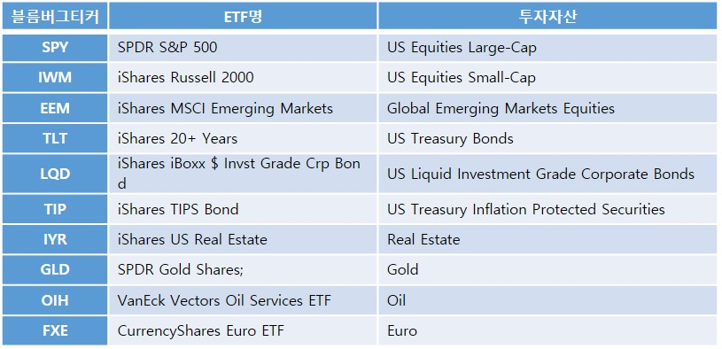

# The Review of Forecasting ETFs With ML Models

**1. Paper Title**
 - [Jim Kyung-Soo Liew & Boris Mayster(2017), Forecasting ETFs with Machine Learning Algorithms](https://papers.ssrn.com/sol3/papers.cfm?abstract_id=2899520)
 - [(PDF file Link)](http://www.smallake.kr/wp-content/uploads/2017/04/SSRN-id2899520.pdf)

**2. Summary**
 - 투자자산군별 ETF의 과거 종가/일평균거래량, 월/요일 변수 데이타 등을 기초로 머신러닝 알고리즘을 이용하여 각 ETF의 상승/하락의 예측가능성을 검증함
 - Support Vector Machines, Random Forests, Deep Neural Networks 알고리즘 사용
 - 생성한 난수(Random Data)를 입력 변수로 사용한 결과값과 비교하여 알고리즘의 정확도 평가
 
**3. Methods**
 - 사용 알고리즘
  1) Deep Neural Networks(DNN)
    - 참고자료링크 : https://ko.wikipedia.org/wiki/심층_학습
    - 파라미터 설정
     ○ Alpha (L2 regularization term) - {0.0001, 0.001, 0.01, 0.1, 1.0, 10.0, 100.0, 1000.0}
     ○ Activation Function - {rectified unit linear function, logistic sigmoid function, hyperbolic tan function} 4
     ○ Solver for weight optimization - stochastic gradient descent
     ○ Hidden layers - {(100, 100), (100, 100, 100)}
  
  2) Random Forests(RF)
    * 참고자료링크 : https://ko.wikipedia.org/wiki/랜덤_포레스트
    * 파라미터 설정
     ○ Number of decision trees - {100, 200, 300}
     ○ Function to measure quality of a split - {Gini impurity, information gain}
  
  3) Support Vector Machines(SVM)
    * 참고자료링크 : https://ko.wikipedia.org/wiki/서포트_벡터_머신
    * 파라미터 설정
     ○ C (penalty parameter of the error term) - {0.0001, 0.001, 0.01, 0.1, 1.0, 10.0, 100.0, 1000.0}
     ○ Kernel - {linear, radial basis function}
  
  4) 데이터를 train set / test set (70%/30%)으로 나누고 3-fold Cross-Validation(교차검증) 진행
 
 - Data Set
   * 2011.01 ~ 2016.01 각 ETF의 Adjusted close price, 일간 trading volume 
    
    
 - Features
  1) Information Set A(XA) : 과거 t기간의 기간 수익률
  2) Information Set B(XB) : 과거 t기간의 일평균 거래량
  3) Information Set C(XC) : 월/요일 더미 변수
  4) Information Set ABC : { XA, XB, XC }
  
 - Target Variable
   * 각 기간별 수익률을 상승의 경우 "1", 하락의 경우 "0"으로 Labeling
   
 - 평가방법
   * Gain Criteria : Information Set을 feature로 측정한 예측정확도와 난수(Random variable)을 Feature로 측정한 예측정확도 값을 비교
    ※ 난수는 0 ~ 1 의 Uniform random distribution을 따르는 값
    
**4. Results & Conclusions**
 - SVM, RF, DNN 알고리즘으로 예측을 실행했을 경우 10일 ~ 60일 기간의 상승/하락 예측의 정확도가 높음. 반면 단기간 예측 정확도는 상대적으로 낮음
 - 일평균거래량 feature의 중요도가 높고, ETF별로 각 feature의 중요도는 달라짐
 - Information Set으로 Social Media 데이터를 이용하거나 다양한 자산과 기간(horizon)을 적용해 보는것을 권함
 
**5. Results & Conclusions**
 
 
 
  
  
    
    
    
    
